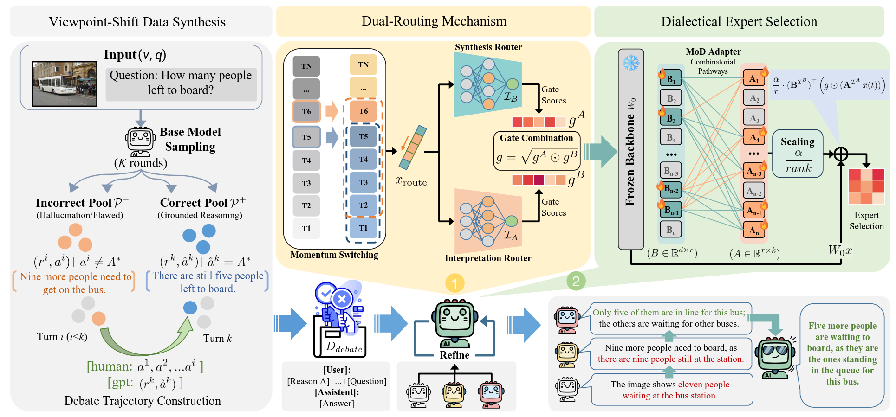
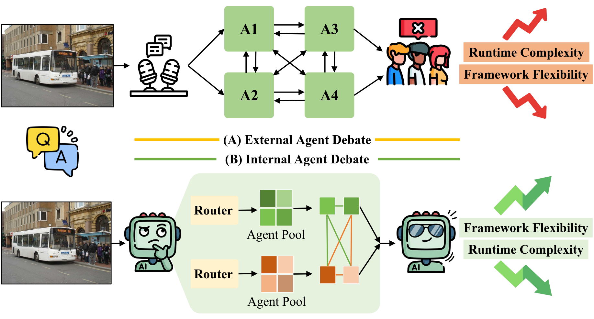

# Mixture of Debaters: Learn to Debate at Architectural Level in Multi-Agent Reasoning

<p align="center">
  
</p>

> Official project page scaffold for **Mixture of Debaters (MoD)**, a parameter-efficient framework that internalizes multi-agent debate into a single vision-language model through dynamic expert routing.

[](#citation)
[](#overview)
[](#method)
[](#project-status)

## News

- **2026-06**: Initial project page and README scaffold for MoD.
- Full training and evaluation code will be released after repository cleanup.

## Overview

Existing multi-agent debate systems usually instantiate multiple LLM/VLM agents and coordinate them through external dialogue. This improves reasoning, but it also introduces fixed debate topologies, heavy memory usage, high token cost, and communication latency.

**Mixture of Debaters (MoD)** reframes debate as an **architectural routing problem**. Instead of running several independent models, MoD keeps a single frozen backbone and injects lightweight dialectical experts. The model learns when to interpret, when to critique, and when to synthesize through routing inside one forward reasoning framework.

<p align="center">
  
</p>

## Highlights

- **Unified self-debate in one model**: Encapsulates debating personas as lightweight expert modules instead of external agents.
- **Dual-routing mechanism**: Decouples role allocation from process control with independent interpretation and synthesis routers.
- **Momentum switching**: Smooths token-level routing using local context to reduce expert-switch jitter.
- **Dialectical expert pools**: Decouples LoRA-A and LoRA-B expert pools, enabling combinatorial reasoning pathways.
- **Viewpoint-shift data synthesis**: Builds debate-style supervision from correct, incorrect, revision, and robustness trajectories.
- **Efficient reasoning**: Achieves a better accuracy-efficiency trade-off than external multi-agent debate and standard MoE-LoRA baselines.

## Method

MoD consists of three core components.

### 1. Viewpoint-Shift Data Synthesis

MoD samples multiple candidate responses from a base model, separates correct and incorrect reasoning chains, and constructs debate trajectories that teach the model to identify flawed reasoning, revise wrong viewpoints, and preserve correct beliefs under misleading context.

The training mixture contains three trajectory types:

| Type | Meaning | Purpose |
|---|---|---|
| `T_pos` | consistent correct chains | learn grounded confirmation |
| `T_rev` | correction and viewpoint shift | learn to revise wrong intermediate answers |
| `T_rob` | robustness trajectories | learn to resist misleading responses |

### 2. Dual-Routing Mechanism

Standard MoE uses one router to dispatch tokens to experts. In debate-style reasoning, one router is not enough because the model must decide both:

1. **Role allocation**: which perspective or expert should inspect the problem;
2. **Process flow**: whether the current step should debate, refine, or synthesize.

MoD introduces two independent routers:

- **Router A** for interpretation-side experts;
- **Router B** for synthesis-side experts.

Their gate scores are combined with a sqrt-product strategy so that expert selection reflects joint agreement while avoiding over-suppression.


### 3. Momentum Switching

Token-level MoE routing can switch experts too frequently, fragmenting the reasoning trace. MoD uses a causal sliding-window routing state so nearby tokens share stable routing context while remaining autoregressive-friendly.

## Project Status

Planned release items:

- [ ] MoD adapter implementation
- [ ] training configs for LLaVA and Qwen-VL backbones
- [ ] evaluation scripts for MMLU, ScienceQA, MMMU, MMStar, POPE, and MME
- [ ] pretrained MoD checkpoints

## Citation

If you find this work useful, please cite:

```bibtex
@inproceedings{liang2026mixture,
  title     = {Mixture of Debaters: Learn to Debate at Architectural Level in Multi-Agent Reasoning},
  author    = {Liang, Dayong and Gong, Kaisong and Cai, Yi and Zheng, Changmeng and Wei, Xiao-Yong},
  year      = {2026}
}
```

## Acknowledgement

This repository template is prepared for the MoD paper project. Please update the code release status, checkpoint links, license, and benchmark scripts before making the repository public.
